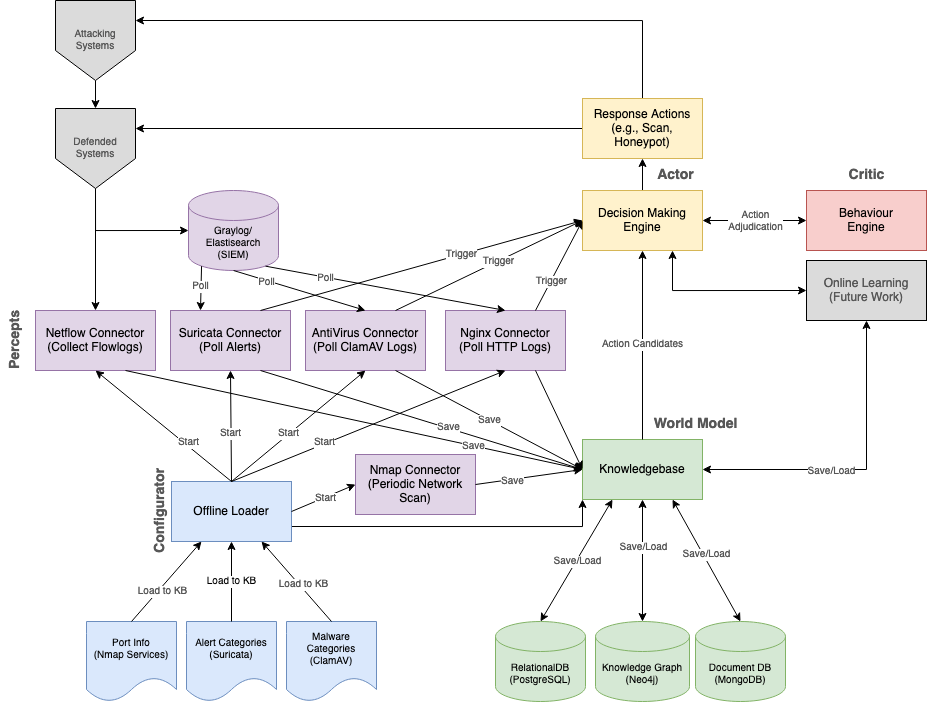

This project will build on the ideas of the AICA framework as outlined in [Theron et al](https://link.springer.com/content/pdf/10.1007%2F978-3-030-33432-1.pdf). This project will work towards a fully-functional agent with increasingly advanced capabilities that can be used in both research and production contexts. The following diagram depicts the high-level structure of the agent:

## Setting up Host Environment (MacOS/Linux)

1. Ensure `git` is installed, use package manager (apt, yum, [brew](https://brew.sh/), etc) if needed.
2. Install Docker; instructions are avaiable [here](https://docs.docker.com/desktop/install/linux-install/).
3. Install micromamba from [https://mamba.readthedocs.io/en/latest/installation/micromamba-installation.html](), and let it update your PATH. You may need to relog after this step. 
4. Ensure `make` is installed, for example in Ubuntu this is part of the `build-essentials` package you can install with apt.
5. Clone this repo, and open in IDE of your choice (ensure .gitignore is updated as necessary)
6. Copy `manager/.env.sample` to `manager/.env` and make any necessary changes. Notably, all of the "<FILLME>" passwords should be set to something unique. The GRAYLOG_ROOT_PASSWORD_SHA2 value should be generated like `echo 'SOMEPASSWORD' | sha256sum`, or an equivalent generate of SHA256 hashes. Make sure this is done before you run `make start` for the first time. If these are changed, a `make rebuild_purge` or `make stop_purge; make start` will be required.
7. Set the MODE variable like `export MODE=emu` (for Bash, other shells may vary).
8. You can now run `make deps` to build your development environment, then `make build` to build the Docker containers, and `make start` to launch AICA. See more below.

## Setting up Host Environment (Windows)

1. Install git from [https://git-scm.com/download/win](); use Unix-style line endings.
2. Install Docker from [https://www.docker.com/products/docker-desktop](); a reboot will be required. 
3. Add Docker to System Path ([instructions](https://learn.microsoft.com/en-us/previous-versions/office/developer/sharepoint-2010/ee537574(v=office.14))): `C:\Program Files\Docker\Docker\resources\bin`
4. Install micromamba from [https://mamba.readthedocs.io/en/latest/installation/micromamba-installation.html](), and let it update your PATH. You may need to relog after this step. 
5. Install Make from [https://gnuwin32.sourceforge.net/packages/make.htm](); yes this is from 2006
6. Add Make to System Path: `C:\Program Files (x86)\GnuWin32\bin`
7. Clone this repo, and open in IDE of your choice (ensure .gitignore is updated as necessary)
8. Copy `manager/.env.sample` to `manager/.env` and make any necessary changes
9. In Powershell, set the MODE variable like: `$env:MODE = 'emu'`
10. You can now run `make deps` to build your development environment, `make build` to build the Docker containers, and `make start` to launch AICA. See more below.

## Building, Testing, and Sharing Changes

It is important to ensure your main branch is up-to-date before each working session, and you should commit your changes incrementally and often to ensure minimal divergence and chance of merge conflicts. Changes should be "intact" functionally (i.e., don't submit partially-completed work) and keep the main repository in a working state. This means you should think about functionality in the smallest possible chunks to keep your contributed work up to date.

You can bootstrap your environment with `make init`, which will create a conda environment for building and testing. 

Changes must be pushed to a branch and PR'ed to main. Before pushing your changes, you should first locally execute a `make test` and ensure it completes successfully. If it does not, either fix the issues or propose exclusions to the relevant test areas (will be subject to peer review).

Once you have a passing build, you should commit your changes to a branch with a commit message that will be meaningful to any reviewers of your code explaining (at a high level) what you changed and why. You can then push the branch and make a PR.

## Running

This code should be run via the Makefile. You will need to specify whether you want to start this in emulation mode or virtualized mode with the MODE environment variable (i.e., MODE should be either `emu` or `virt`). If using "virt" mode, which is intended for live usage capturing from a real network outside the Docker environment, you much copy the docker-compose-local-overrides.yaml.example file to docker-compose-local-overrides.yaml and modify as appropriate. 

When starting from scratch, run the following: `make build && make start`. Subsequently, use `make stop` and `make start` (or `make restart`) to stop/start the containers and `make build` to build them again (`make rebuild` is a handy alias for stop/build/start). You can use `make clean` to clean up all container- and code-related files. 

Once you have started the agent, you can use the various `make <system>-shell` commands (e.g., `make attacker-shell`) to open shells on various containers. You might wish, for example, to start a shell on the attacker and nmap the `target` host. 

You can view logs from the Dockerized containers with `make logs`. This will show all containers, so you might wish to pipe this to `grep`/`egrep` to include/exclude containers by name as desired. For example: `make logs | egrep ^(manager\b|manager_graphdb)`.

You can monitor the agent through several interfaces:

* [http://localhost:8000](): Primary front-end. Django app as defined in `manager/aica_django/`.
* [http://localhost:7474](): Neo4j web interface
* [http://localhost:5555](): Celery Flower instance, where you can monitor task execution

## Code in this repository

The AICA agent is built as a Django project, and so the normal Django conventions are followed in the `manager/` directory. Tests should be added to `manager/aica_django/tests` and use Django testing conventions. Other top-level directories contain files for other containers in the emulated environment. They should contain at least a `Dockerfile` and any files needed to be copied into the built container.

## Other files and what they do

* `Makefile` is the primary entry point for this code. It should include test entrypoints as well as entrypoints.
* `.dockerignore` tells Docker what <em>not</em> to copy into container contexts
* `environment.yml` contains Conda environment specification for build/test. 
* `.gitignore` tells git which files to never check into the repository.
* `.yamllint` configures the YAML lint that runs at build/test time
* `docker-compose.yml`  is the YAML file instructing docker-compose how to create the necessary containers and networks for the agent. The additional `docker-compose-emu.yml` and `docker-compose-virt.yml` have addition definitions intended for those modes only and are additionally invoked in the `Makefile` based on the MODE environmental variable.

## Maintainers

The primary maintainer for this project is [@bblakely-anl](https://github.com/bblakely-anl), a cybersecurity and machine learning researcher at Argonne National Laboratory.
